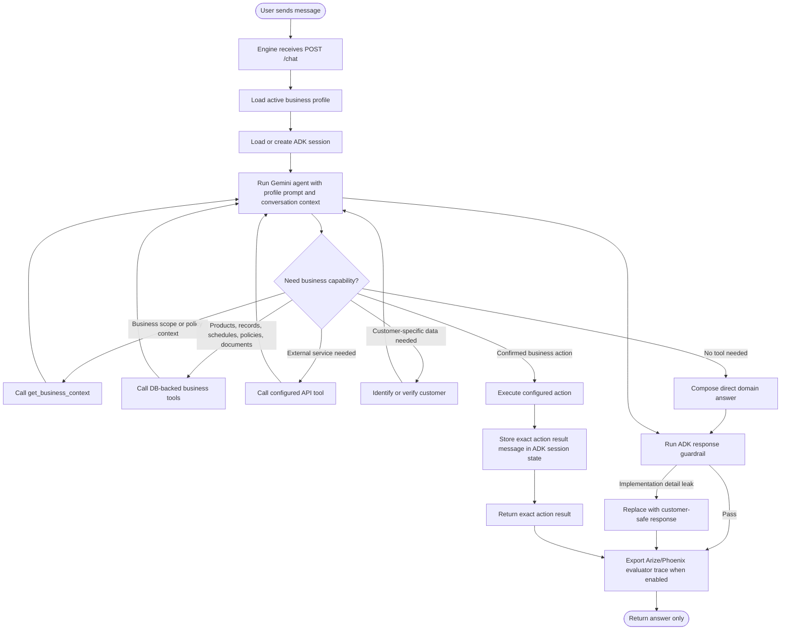

# Current Conversation Flow

This flow represents the conversation logic currently executed by the chat endpoint. The engine now uses Google ADK as the active orchestration runtime, so the conversation is not routed through a separate local decision endpoint or legacy gate pipeline.

The HTTP app is intentionally thin. It loads the selected profile, DB adapter, external integrations, internal tools, policy bundle, Arize evaluator, and ADK runtime. The `/chat` endpoint returns only the customer-facing answer.

ADK owns the session and Gemini agent loop. The agent receives the external prompt template from `engine/prompts/adk/customer-service-agent.prompt.md`, then decides when to call business tools. Tool calls are still owned by the engine: DB retrieval, customer identification, verification, external API access, internal method calls, and business action execution are implemented as engine functions exposed to ADK.

Policies are now blended into the ADK path as instruction context, tool constraints, and response guardrails. For example, protected data is blocked until the session has the required customer identification and verification state, and business actions require explicit customer confirmation before execution.

Arize/Phoenix is attached to the active ADK path through guardrail and action-result evaluation. It records evaluator traces when enabled, while local fallback decisions keep the runtime usable without an external evaluator.
