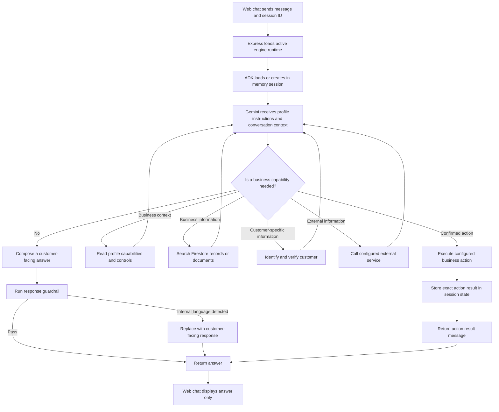

# Request Flow

This is the active path executed by `POST /chat`.



## HTTP Contract

The frontend sends a message, optional request ID, session ID, and user context. The engine returns only:

```json
{
  "requestId": "generated-or-supplied-id",
  "answer": "customer-facing response"
}
```

Routing decisions, tool results, verification state, and evaluation details remain inside the engine.

## Agent Instruction

The ADK agent instruction is rendered from `engine/prompts/adk/customer-service-agent.prompt.md`. It combines the active profile with business controls and tells Gemini to guide proactively, retrieve facts through tools, stay within the business domain, compare meaningful options, and request explicit confirmation before actions.

## Tool Selection

The active agent can use these engine-owned capabilities:

- `get_business_context`
- `search_business_data`
- `search_business_documents`
- `identify_customer`
- `verify_customer`
- `execute_business_action`
- `query_external_service`, only when the profile declares an integration

The model selects a tool based on the conversation. The tool implementation remains authoritative for access and execution.

## Evaluation

Response and action evaluations always produce a local decision so the application remains usable without an external collector. When Arize/Phoenix is enabled, the same input, evidence, and decision are exported as evaluator traces for monitoring.
