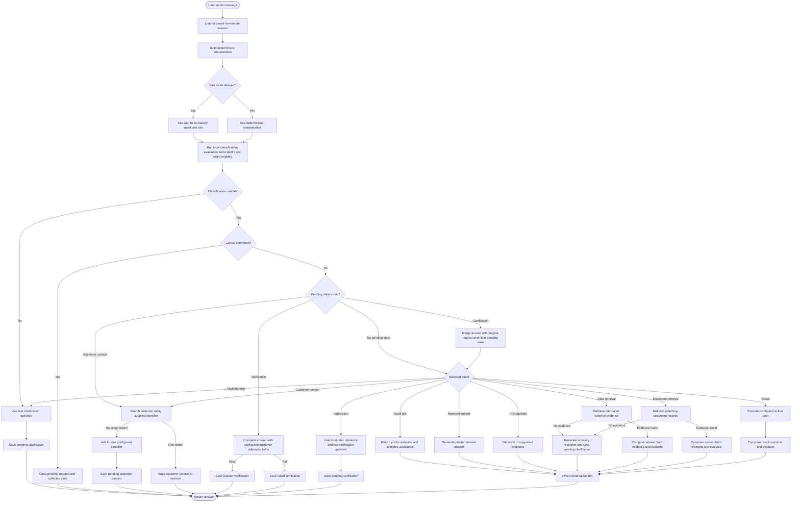

# Current Conversation Flow

This flow represents the conversation logic currently executed by the chat endpoint. It follows a session across multiple messages rather than treating each message independently.

The engine first loads the session, which currently lives in the engine process. The session contains recent turns, one pending state, collected slots, resolved customer context, and verification status.

Routing starts with deterministic rules. Cancellation, direct pending verification answers, greetings, configured action confirmations, obvious lookups, and other clear intents can avoid a Gemini routing call. Ambiguous messages are classified by Gemini using the current profile and session.

Pending customer context and verification states take priority over new fulfillment work. A request may also be redirected to customer identification before retrieval when the active profile requires identity for customer-specific data.

The active fulfillment paths are profile welcome, relevant answer, customer context resolution, verification, data retrieval, document retrieval, action execution, unsupported response, and clarification. Every returned message is stored as a conversation turn. Only the latest 20 turns are retained.

The current clarification merge stores a merged request topic and clears the pending clarification. It does not yet rerun the whole turn from the beginning. Slot-filling utilities exist in the engine, but the current router does not create a slot-filling pending state, so slot filling is not presented as an active Solution flow.
