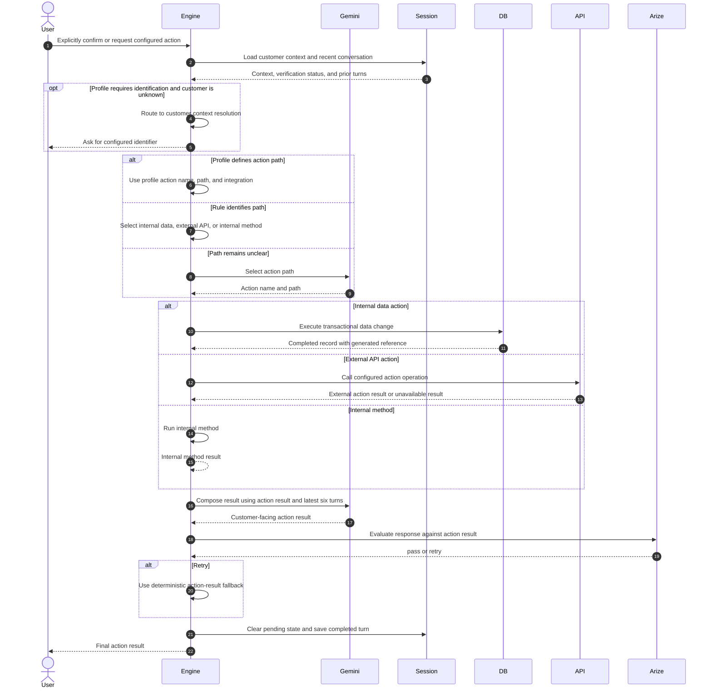

# Action Execution

The current action confirmation is conversational rather than a dedicated pending-confirmation state. Routing recognizes explicit confirmation phrases such as "yes," "confirm," "go ahead," or domain-specific confirmation wording. Before that point, a Gemini action classification is converted to data retrieval so the assistant can continue comparison or discovery.

For most business profiles, the action path is fixed in profile configuration. The supported paths are a Firestore data change, a configured external API call, or an internal Engine method.

The internal-data path runs a Firestore transaction that increments a configured counter and writes an action record. The returned record includes the generated reference and completion result.

The result prompt receives the actual execution result and the latest six turns, allowing the final message to repeat a previously selected option, location, or schedule when that context is present.

The current action handler checks customer identification when the profile defines identifying fields. It does not independently enforce the session verification status before execution; verification is triggered earlier by routing for protected topics.
