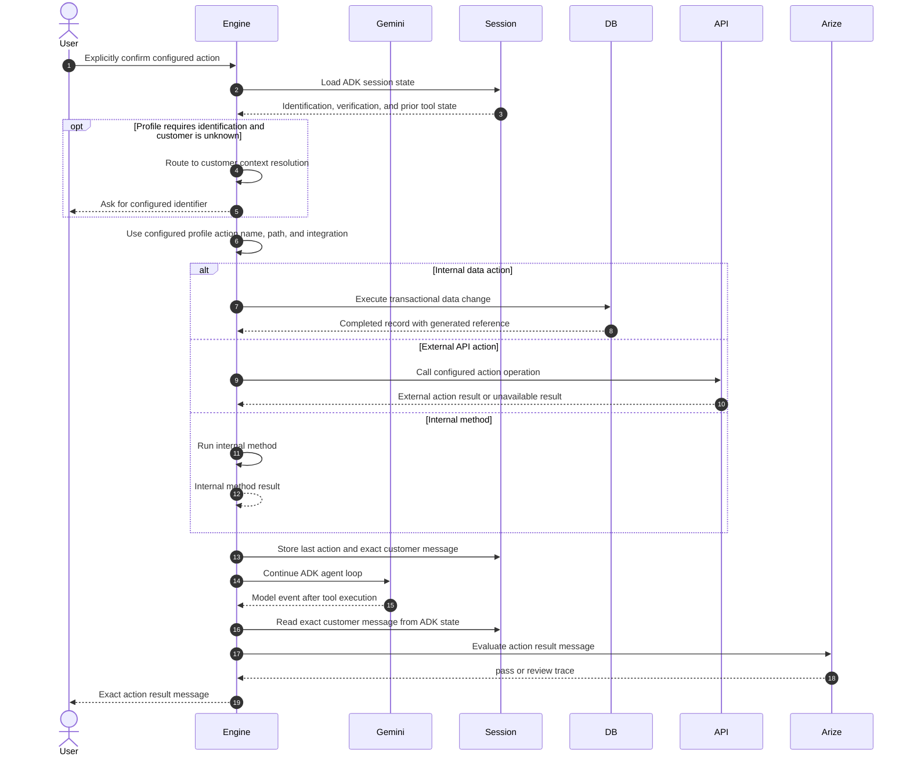

# Action Execution

Action confirmation is enforced by the ADK business tool. The tool refuses execution unless the latest customer message contains explicit confirmation such as "yes," "confirm," "go ahead," or domain-specific confirmation wording. Before that point, the agent continues comparison, discovery, or confirmation.

For most business profiles, the action path is fixed in profile configuration. The supported paths are a Firestore data change, a configured external API call, or an internal Engine method.

The internal-data path runs a Firestore transaction that increments a configured counter and writes an action record. The returned record includes the generated reference and completion result.

The action tool checks identification and verification state before execution when the active profile requires protected customer context. After execution, the tool creates the customer-facing result message from the actual action result. The ADK response callback returns that message exactly so Gemini cannot add unsupported promises.
