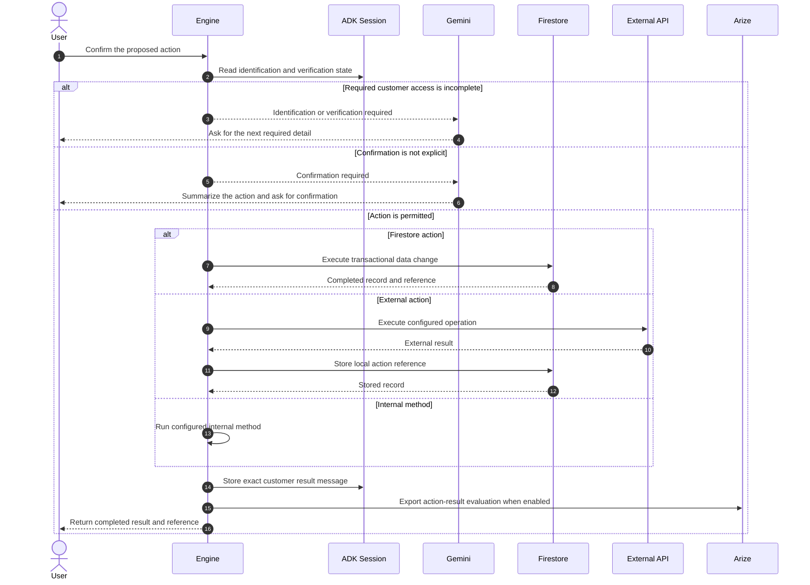

# Protected Actions

## Confirmation Rule

The action tool accepts explicit confirmation phrases such as “yes,” “confirm,” “go ahead,” “book it,” or “submit it.” An inquiry, preference, comparison, or ambiguous reply cannot execute an action.

## Access Rule

If the active profile protects customer data or actions, the tool checks session identification and verification state before execution. Gemini cannot bypass this check because it runs inside the engine-owned tool.

## Action Paths

Profiles currently support three execution paths:

1. A Firestore transaction that updates business data and creates a reference.
2. A configured external API operation, followed by a local action record.
3. An internal business method executed within the engine.

## Result Integrity

The action tool creates the customer-facing message from the actual execution result and stores it in session state. The ADK response callback consumes that message and returns it exactly. This prevents the model from adding unsupported promises about delivery, notifications, timing, or follow-up.

The runtime also contains a narrow fallback for confirmed actions when Gemini asks for confirmation again after all required access conditions have already been met. In that case, the engine executes the configured action directly and still formats the answer from the real result.
