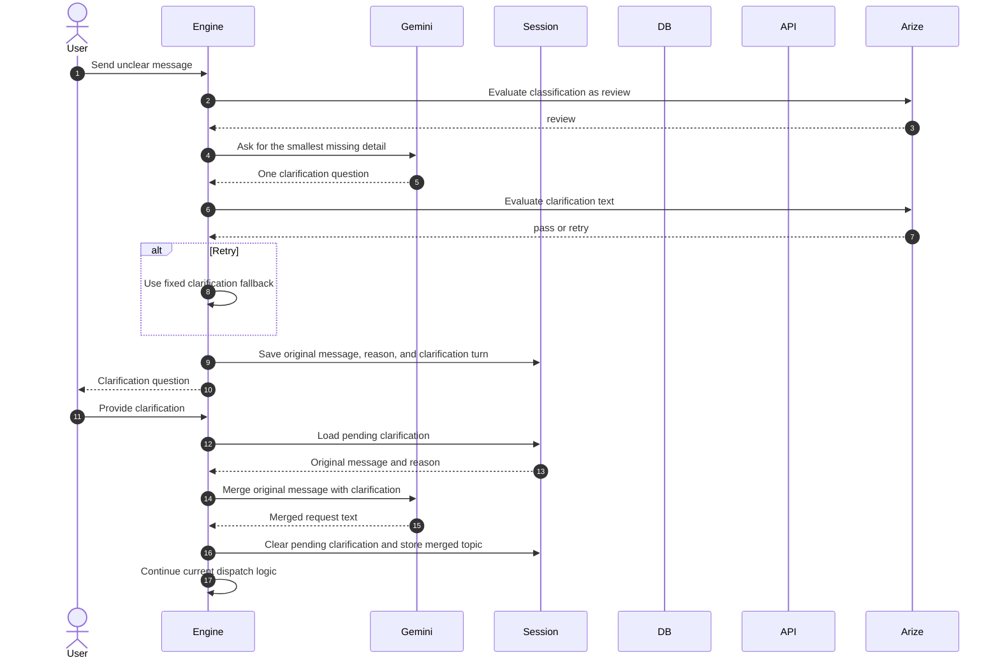

# Clarification Flow

The engine asks only one clarification question and stores the original message in the pending state.

On the next turn, Gemini merges the clarification with the original message. The current implementation stores that merged text in `collectedSlots.topic` and clears the pending state. It does not restart routing from the beginning with the merged text, so this page intentionally does not claim that the merged request is immediately fulfilled in the same turn.
