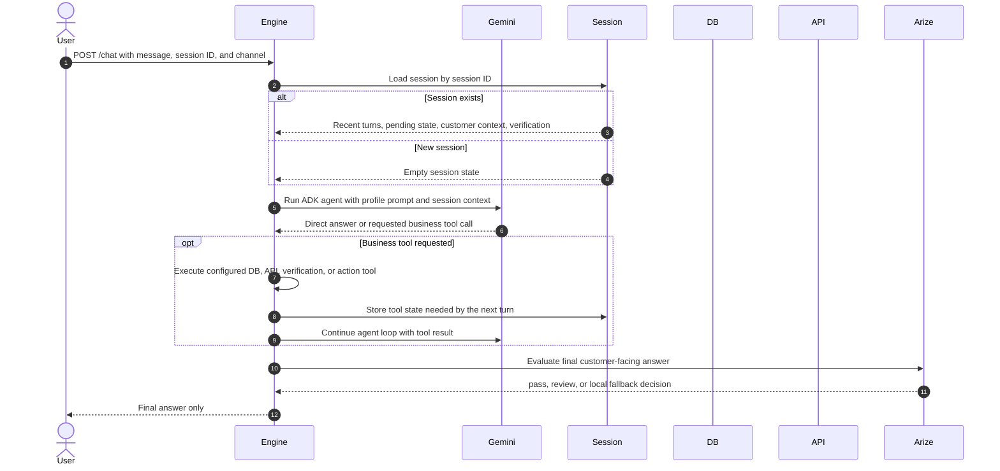

# Conversation Entry

The chat endpoint returns only `requestId` and `answer`; the frontend does not receive route, evaluation, or internal participant details.

Gemini now runs inside the ADK agent loop rather than a separate routing endpoint. The engine still owns the business tools and guardrails, so Gemini can request capability but cannot bypass configured data access, verification, or action-confirmation rules.
