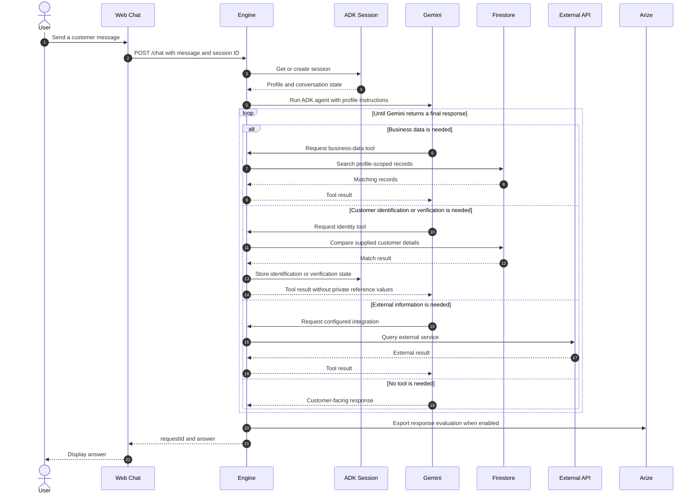

# Conversation Lifecycle

## Multi-Turn State

The same session ID reconnects later messages to the ADK session. Tools update only the state needed for later turns, such as the matched customer ID, verification result, or latest action result.

## Customer Identification

Identification is profile-specific. Public discovery flows may need no identity at all. Protected profiles expose configured identifier fields to the agent. The identity tool accepts only values supplied by the customer and requires exactly one matching Firestore customer record.

## Customer Verification

Verification compares customer-supplied private answers with selected reference values. The tool returns match counts and pass/fail status but never returns the stored reference values to Gemini or the customer. The profile defines which reference categories are used and how many matches are required.

## Customer-Facing Boundary

The frontend never needs to know which tool ran, why access was denied, or which evaluation decision was produced. It receives the answer only, keeping the chat interface independent from engine internals.
