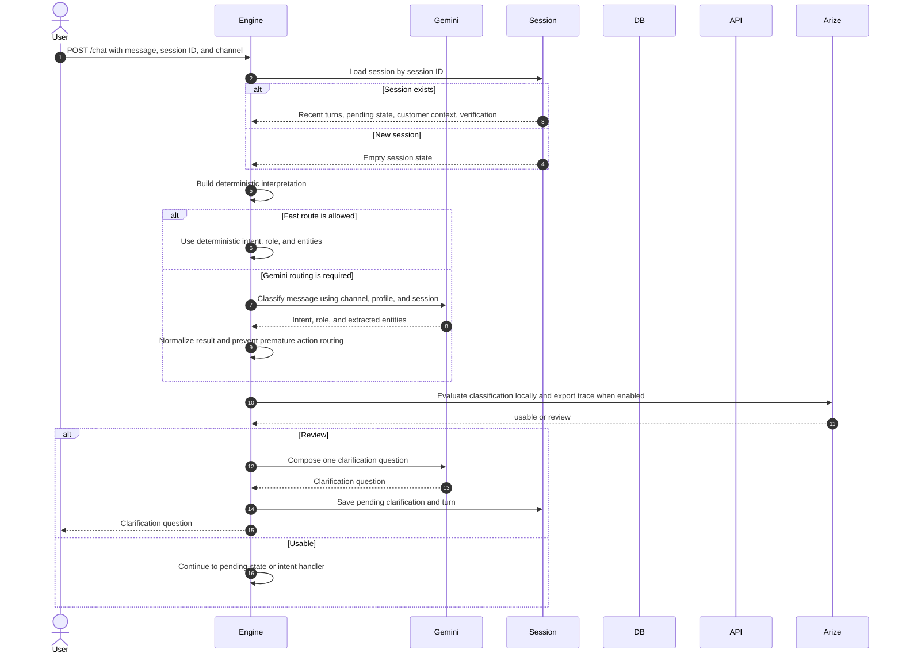

# Conversation Entry

The chat endpoint returns only `requestId` and `answer`; the frontend does not receive route, evaluation, or internal participant details.

The fast route is used only when the deterministic interpretation is considered sufficient. If a pending state exists, most messages still go through control-message inspection, except direct answers to pending verification.

When Gemini labels a message as an action but the message is not an explicit configured confirmation, the engine changes the route to data retrieval. This keeps comparison and exploration separate from execution.
