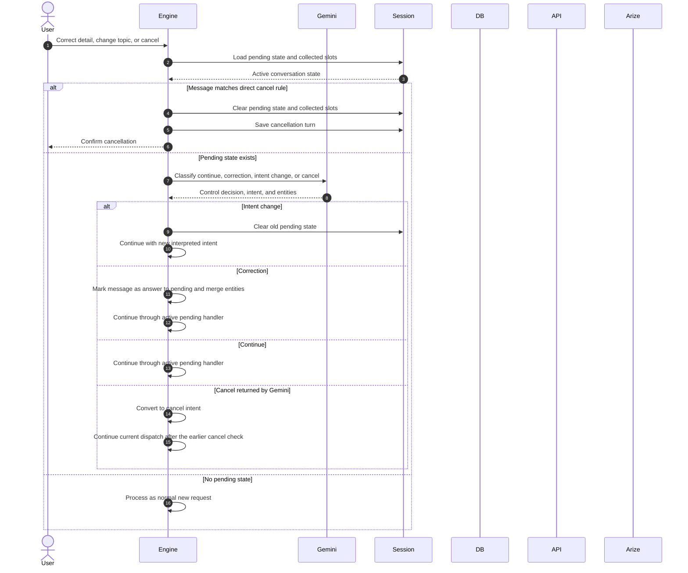

# Correction, Intent Change, and Cancel

Cancellation has a deterministic route for messages beginning with supported cancel, reset, or stop commands. It clears the pending state and all collected slots, but it does not clear customer context, verification status, or prior turns.

When a pending state exists, Gemini classifies the message as continuation, correction, intent change, or cancel. An intent change clears the old pending state before dispatching the new intent.

Correction currently merges extracted entities into the interpretation and marks the message as an answer to the pending flow. There is no separate Arize evaluation for conversation-control decisions in the current implementation.

The direct cancel rule is the reliable cancellation path. A cancel decision returned only by the later Gemini control inspection is converted to a cancel intent after the engine's initial cancel branch has already run. The current turn therefore continues through the remaining dispatch logic instead of immediately clearing state. This is a current runtime limitation, not the intended final behavior.
