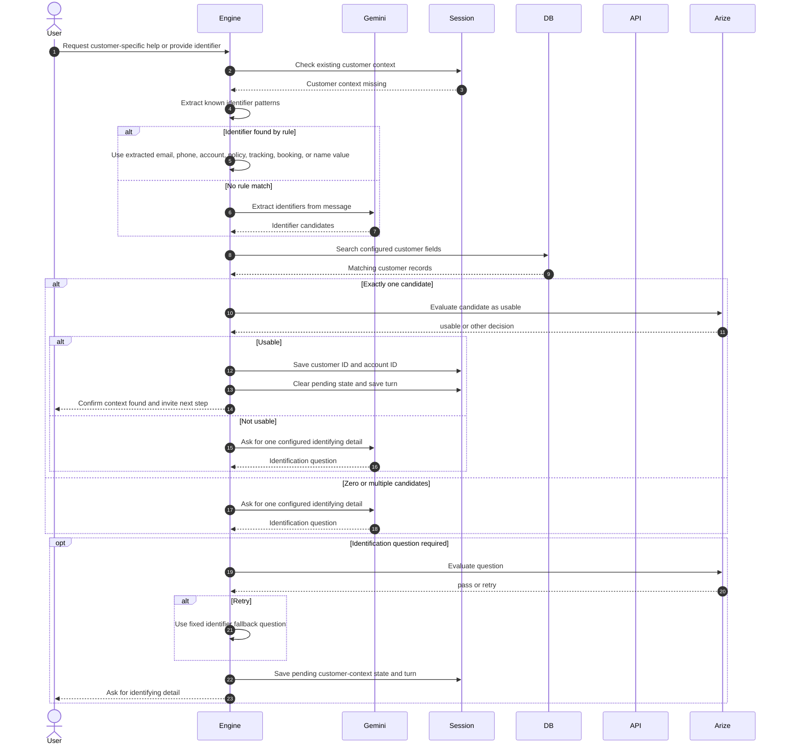

# Customer Context Resolution

Customer context resolution is separate from verification. Its purpose is to find one customer record using identifiers configured for the active profile.

The engine first extracts common identifier formats without Gemini. Gemini is used only when no deterministic identifier is found. Firestore search checks the profile's configured customer search fields.

Only one matching record is accepted. The session stores a small context object containing the customer ID and account ID, not the full Firestore customer record. Zero or multiple matches lead to another identifying question.

After a match, the engine currently returns a confirmation or a prompt to proceed. It does not automatically replay the original customer-specific request in the same turn.
