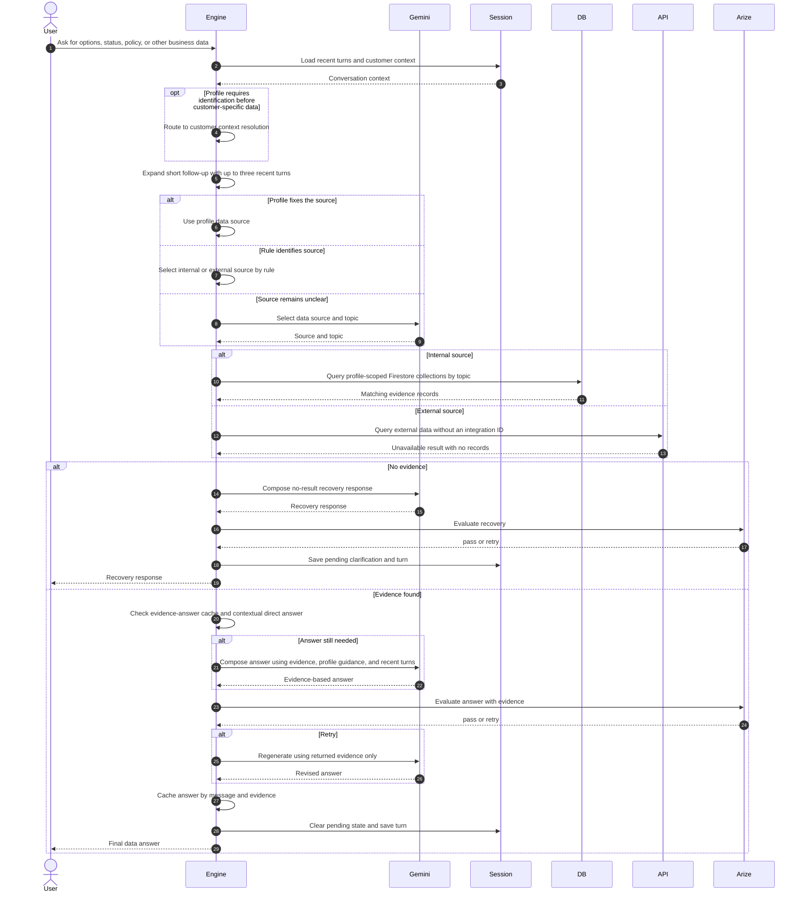

# Data Retrieval

Short follow-up messages are expanded with recent conversation text before retrieval. This allows a message such as a preference, comparison request, or time choice to remain connected to earlier options.

Most current profiles set their data source in profile configuration, so source selection often skips Gemini. Internal retrieval searches configured Firestore collections and fields inside the active simulation namespace.

The external-data branch exists, but the current retrieval call does not pass an integration ID to the API adapter. The adapter therefore returns an unavailable result with no records, which continues into the no-evidence recovery path. External actions do pass their configured integration ID; external data retrieval does not yet do so.

With guided responses enabled, Gemini normally composes the customer-facing answer from the evidence, business offers, supported action, decision guidance, and recent turns. A small deterministic contextual answer exists for specific booking follow-ups.

Arize's local evidence evaluation passes when evidence is present. The trace contains the candidate and evidence when Phoenix/Arize is enabled.
