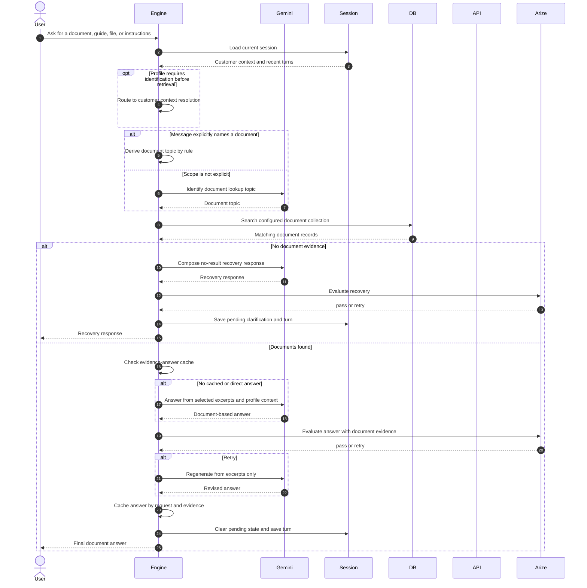

# Document Retrieval

Documents are stored as records in the profile's Firestore namespace; there is no separate document-management application in the current architecture.

An explicit document message uses a deterministic topic rule. Otherwise Gemini supplies the lookup topic. The DB performs token matching across the configured document search fields.

Guided profiles use Gemini to compose the answer from excerpts. The response is evaluated with the retrieved records and retried once when the local decision requests it.
