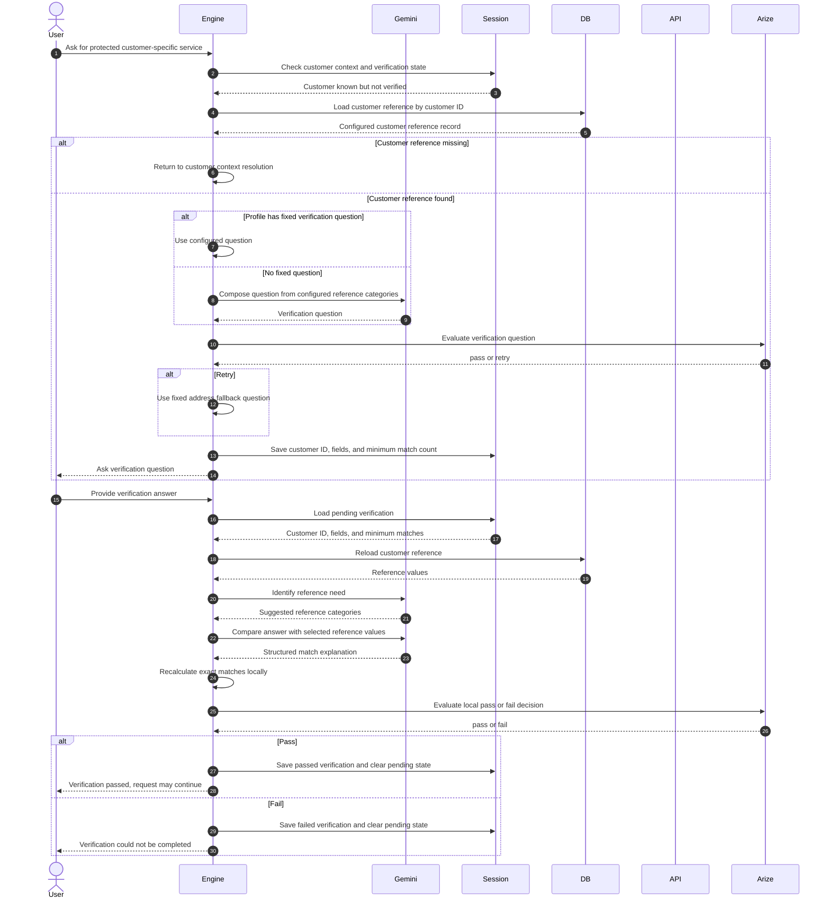

# Customer Verification

Verification begins only after customer context exists and the active profile requires verification for the topic. Some profiles provide a fixed question; otherwise Gemini composes one from configured reference categories.

The engine currently calls Gemini to identify the reference need, but that result is not used to select the fields. The pending state's configured verification fields remain authoritative.

Gemini then compares the answer, but the final boolean is overwritten by a deterministic local count of reference values found in the normalized user answer. The configured `minimumMatches` controls the threshold.

The result is stored in the in-memory session. A passed result prevents the profile's verification trigger from asking again during that session.

The current implementation returns a verification result message. It does not automatically resume the protected retrieval or action in the same turn; the user or simulator continues with the next message.
