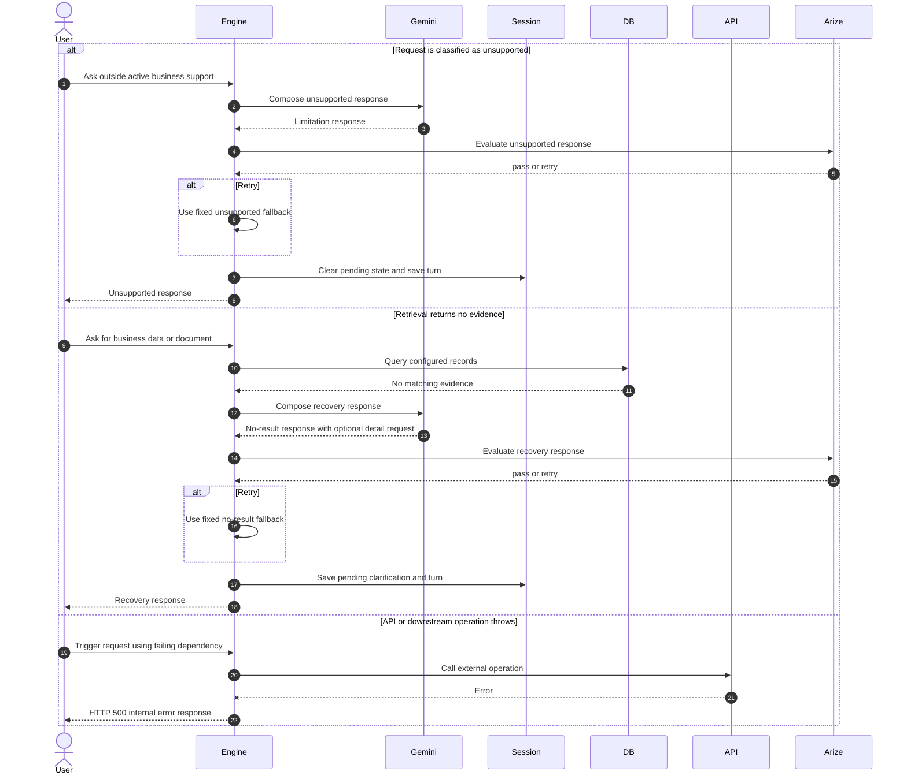

# Unsupported Request and Recovery

The active failure handler has two conversational modes: `unsupported` and `not_found`.

Unsupported requests receive a Gemini-written limitation message. A no-result retrieval receives a recovery message and creates a pending clarification so the next user message can add another detail.

Both responses are evaluated locally through Arize. An empty or rejected candidate is replaced with a fixed fallback.

There is not yet a dedicated conversational recovery branch for thrown Firestore, API, or Gemini errors. Uncaught errors reach the Express error middleware and return an HTTP 500 JSON error. This diagram shows that current limitation rather than a planned graceful fallback.
