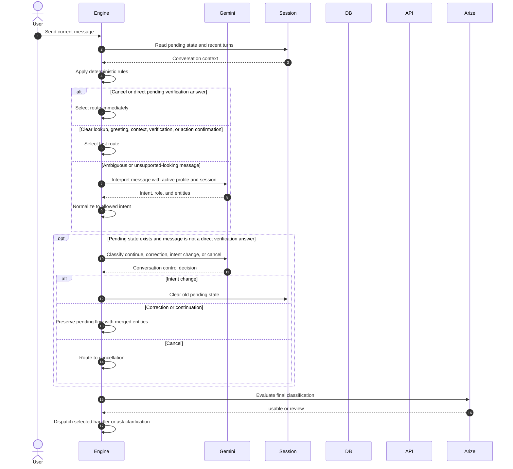

# Conversation Routing

Deterministic routing recognizes current pending verification answers, greetings, configured action confirmations, contextual follow-ups, domain-relevant direct questions, document requests, action verbs, customer identifiers, and common retrieval topics.

Gemini is used when those rules are not sufficient. Its output is constrained to the engine's allowed intents. The engine then applies one additional rule: a configured action must be explicitly confirmed; otherwise the message remains in the information and decision phase.

Arize receives the normalized interpretation. Its current runtime classification result is local. Phoenix/Arize tracing is optional and does not become a separate synchronous decision maker.
