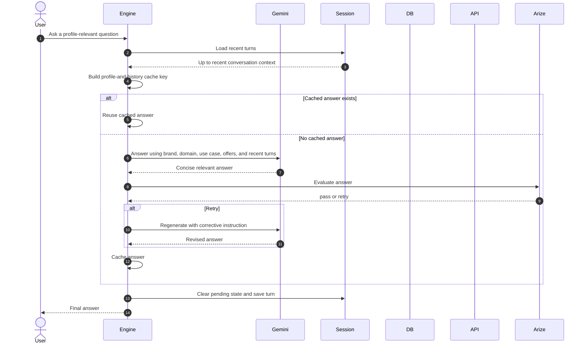

# Relevant Answer

This path is for a direct question that is relevant to the active business but does not require Firestore evidence, document excerpts, customer identification, verification, or an action.

The prompt receives the active profile and the latest four turns. The cache key also includes the profile and recent history, preventing a response from one profile or conversation context from being reused as another.

Arize's current local answer evaluation retries only when the candidate is empty or another configured local condition requests it. The retry is generated once before the turn is saved.
