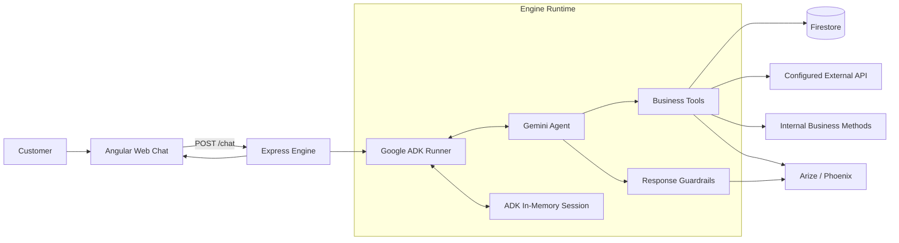

# Technical Architecture

The current implementation runs Google ADK directly inside the engine. Express remains the HTTP boundary, while ADK owns the agent loop and in-memory conversation session.

## Runtime Responsibilities

| Component | Current responsibility |
| --- | --- |
| Web chat | Sends the customer message and displays only the returned answer. |
| Express engine | Loads the active profile and exposes `/health` and `/chat`. |
| Google ADK | Runs the agent loop, tool calls, callbacks, and session lifecycle. |
| Gemini | Understands the conversation, decides when a business capability is needed, and composes customer-facing language. |
| Business tools | Enforce data access, identification, verification, confirmation, and action rules. |
| Firestore | Stores profile-scoped business records, policies, documents, customers, and action records. |
| External API | Represents a configured system outside this deployment. |
| Arize / Phoenix | Receives evaluation traces for response guardrails and action results when enabled. |

## Profile Boundary

The engine starts with one profile selected through `ENGINE_PROFILE_ID`. A profile defines the business identity, supported offers, decision guidance, Firestore collections, customer identification rules, verification requirements, integrations, and configured action.

Profile configuration is loaded before the ADK agent is created. The resulting instructions and tools therefore belong to that business for the lifetime of the engine process.

## Session Boundary

ADK currently uses `InMemorySessionService`. Session state includes the profile ID, customer identification status, customer ID, verification status, and action state. Restarting the engine clears active conversation sessions. Firestore is business data storage, not the current conversation-session store.

## Control Boundary

Gemini can request a capability, but engine-owned tools decide whether it is allowed. Protected data requires the configured identification and verification state. Business actions require explicit confirmation. The final callback can replace responses that expose internal implementation language, and confirmed action results are returned from the actual tool result.
